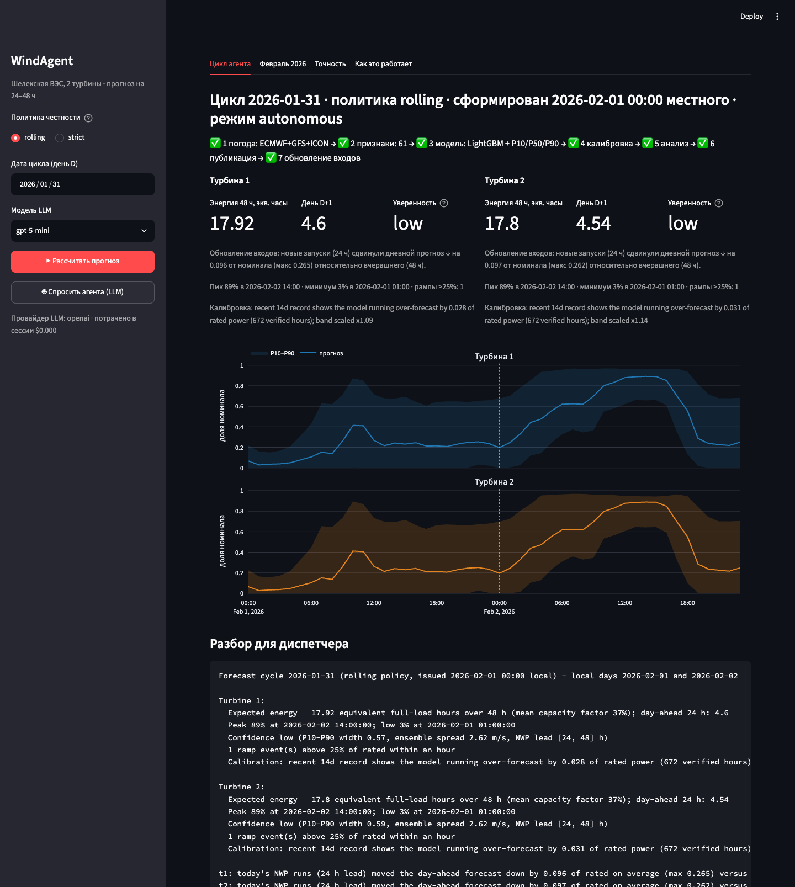
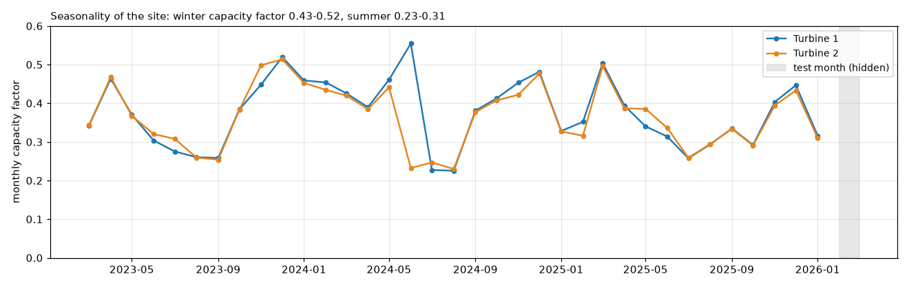
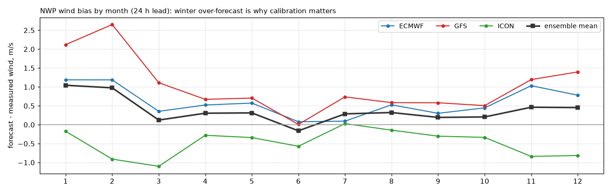
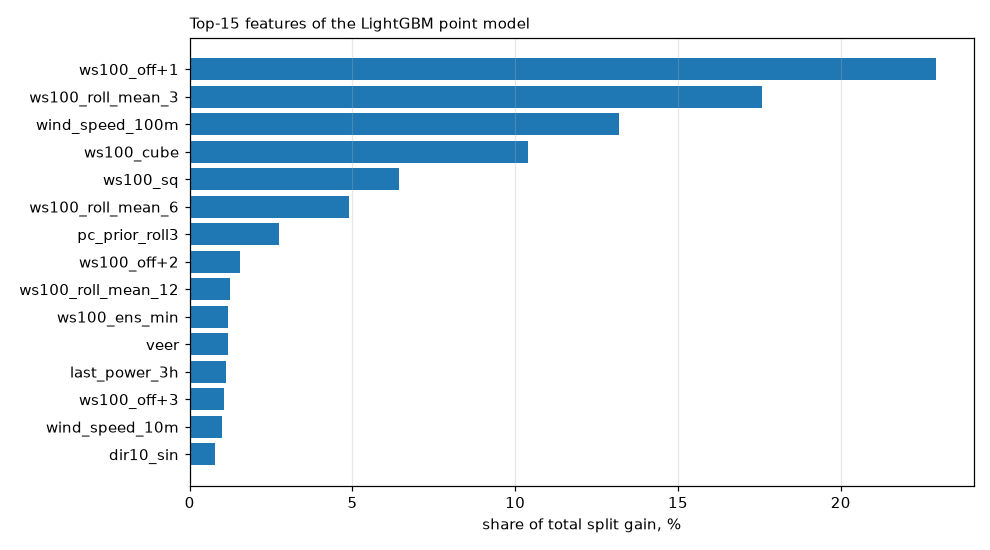
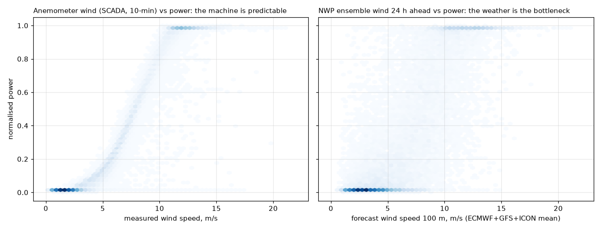

# WindAgent: agentic 24–48 h hourly power forecasting for a wind farm

**Русская версия: [README.ru.md](README.ru.md)**

Solution for the HackAlemAI case *"Agentic AI for wind farm output forecasting"* (`task.md`).
The system fetches archived forecasts of three numerical weather models for the turbine
coordinates, prepares features, runs a trained model, publishes an hourly forecast for the next
two days per turbine, analyses the result, measures how much fresher inputs changed the answer,
and learns from its own verified errors. The deliverable is the hourly normalised power for
**1–28 February 2026**, produced by replaying 28 daily cycles ("on 31 January, on 1 February, …
on 27 February") with the weather forecasts that were available at each of those moments.

Site: two turbines in the Shelek wind corridor, Almaty region (43.645 N, 78.536 E, ~400 m apart).

**Contents:** [Five-minute check](#1-five-minute-check) · [Headline results](#2-headline-results) ·
[Task and data](#3-the-task-and-the-data) · [Processing and features](#4-data-processing-and-feature-engineering) ·
[Training](#5-model-training) · [Evaluation](#6-evaluation) · [Agent architecture](#7-agentic-architecture) ·
[Experiments](#8-experiments) · [Self-assessment](#9-self-assessment-against-the-case-criteria) ·
[Limitations](#10-limitations-and-roadmap) · [Handoff for the jury's AI agent](#11-handoff-for-the-jurys-ai-agent) ·
[Repository structure](#12-repository-structure)

---

## 1. Five-minute check

Everything reproduces offline from the repository: the weather archive and the trained model are
committed, no API keys are needed. Python 3.11+ (verified on 3.13, macOS and a fresh clone).

```bash
brew install libomp                                   # macOS only, LightGBM needs OpenMP
python3 -m venv .venv && .venv/bin/pip install -r requirements.txt
.venv/bin/python -m pytest -q                         # 14 offline honesty tests, ~5 s
.venv/bin/python -m src.backtest --policy rolling     # the February 2026 deliverable, ~1 min
.venv/bin/python -m src.agent --date 2026-01-31       # one agent cycle with an operator briefing
```

Expected: `outputs/february_2026_rolling_submission_local.csv` with 1 344 rows and the line
`Submission: ... per turbine {'t1': 672, 't2': 672}`. The same commands are in the `Makefile`
(`make test`, `make replay`, `make agent`); `AGENTS.md` is a one-screen cheat sheet.

Dashboard: `.venv/bin/python -m streamlit run app.py`, then open http://localhost:8501.



---

## 2. Headline results

Accuracy is measured on a **122-day out-of-sample replay** (cycles 1 Oct 2025 – 30 Jan 2026,
11 436 verified hours). Power is normalised to rated capacity, so MAE reads as a fraction of
nameplate: MAE 0.16 means 16 % of rated power.

| Day-ahead forecast (local day D+1) | NWP lead | MAE | RMSE | R² | Skill vs persistence |
|---|---|---|---|---|---|
| **WindAgent, `rolling` policy** (primary deliverable) | 24 h | **0.1586** | 0.2134 | 0.651 | 53 % |
| WindAgent, `strict` policy (conservative) | 48 h | 0.1760 | 0.2370 | 0.570 | 47 % |
| Power curve on NWP wind, no ML | 24–72 h | 0.1948 | 0.2537 | 0.508 | 42 % |
| Persistence (yesterday repeated) | — | 0.3342 | 0.4204 | −0.350 | 0 % |
| Climatology (hour-of-day mean) | — | 0.3185 | 0.3617 | 0.000 | 5 % |

Also measured on the same replay (`rolling`):

- **The P10–P90 band covers 76.4 %** of outcomes against an 80 % target after conformal
  calibration (69.7 % before it).
- **The daily recompute is worth 9.5 % of the error.** Every hour is forecast twice, first as day
  D+2 and then as day D+1 from newer weather runs: on 5 694 identical hours MAE falls from 0.1738
  to 0.1573.
- **Fresher inputs change the answer in 234 of 244 turbine-cycles** by more than 0.02 of rated
  (mean change 0.065). This is the "recompute when inputs update" step of the brief, measured
  rather than asserted.
- Both turbines are forecast equally well (MAE 0.1586 each): they share one grid cell of the
  weather models.


---

## 3. The task and the data

### 3.1 SCADA dataset

Two CSV files (one per turbine), UTF-8, 10-minute resolution, 11 Mar 2023 00:00 – 31 Jan 2026
23:50. Columns: record id, timestamp, mean wind speed (m/s), normalised active power (0–1) and
mean ambient temperature (°C). February 2026, the test month, is not in the files: the organisers
hold the actual production and score the submitted forecasts against it.

| | Turbine 1 | Turbine 2 |
|---|---|---|
| Rows | 142 360 | 149 499 |
| Missing on the 10-min grid | 6.6 % | 1.9 % |
| Longest gap | 18 May – 17 Jul 2024 (outage, ~2 months) | 57 h in May 2024 |
| Power ceiling | 0.99 | 0.97 (0.98–0.99 in winter) |

No NaNs, duplicates or malformed rows. The power curve read from the data is clean: cut-in at
~2.5–3 m/s, rated from ~11–12 m/s, no high-wind cut-out up to 23 m/s. Mean wind 6.45 m/s, 95th
percentile 12.8 m/s; temperature −19 … +44 °C. The two machines are near twins: wind correlates
at 0.99, power at 0.96, temperature at 1.00. Downtime with wind above 6 m/s is 0.4–0.6 % of hours.



### 3.2 What the data told us

- **The SCADA clock is UTC+6 for the whole period.** Kazakhstan moved Almaty from UTC+6 to UTC+5
  on 1 March 2024, so a mid-dataset jump was the obvious risk. Cross-correlating SCADA against the
  weather models at 10-minute resolution shows none: the wind peak sits at 6.00 h and the
  temperature peak at 6.83 h (the extra lag is nacelle-sensor thermal inertia), stable for both
  turbines and both eras. All weather sources are in UTC, so 6 hours are subtracted when joining.
- **The weather is the bottleneck, not the machine.** With the turbine's own anemometer, a single
  power curve reaches MAE 0.027 (R² 0.98). With 24-hour-ahead NWP wind the same curve gives 0.19.
  Almost all remaining error is wind-forecast error, so the effort went into the weather input.
- **Weather models over-forecast winter wind**: the ensemble mean by +1.0 m/s in January and
  February against +0.2 … +0.4 m/s in summer, mostly at night. These are exactly the months to be
  forecast, which is why online calibration is part of the loop.
- **No icing or degradation**: power at 6–10 m/s of measured wind holds at 0.45–0.50 in every
  month and year, so seasonal error is an input problem, not a turbine problem.

### 3.3 Weather sources

Open-Meteo, free and keyless, by turbine coordinates. Three **independent** global models are
fetched separately instead of a pre-blended "best match": ECMWF IFS 0.25°, NOAA GFS and DWD ICON
(regional high-resolution models do not cover 78° E). Variables: wind speed at 10 m and 100 m,
wind direction at both heights, gusts, 2 m temperature, surface pressure, relative humidity.

The Historical Forecast API archive exposes several "layers" of every variable:

| Variable | What it is | Usable for an honest replay? |
|---|---|---|
| `wind_speed_100m` | the most recent run's estimate, ~0–24 h lead | **no**, this is nearly the analysis |
| `wind_speed_100m_previous_day1` | what the models predicted **24 h before the target hour** | yes |
| `wind_speed_100m_previous_day2` | 48 h before the target hour | yes |
| `wind_speed_100m_previous_day3` | 72 h before the target hour | yes |

A fact we verified by measurement: `previous_dayN` is a **fixed offset from the target hour**,
not "the 00Z run of day D". The wind error inside `previous_day1` does not grow from hour 0 to
hour 23 of a day as it would inside one run. And these are genuine forecasts, not relabelled
analysis: accuracy decays monotonically with lead (100 m wind vs the turbine anemometer, 2024–2026):

| Archive layer | RMSE, m/s | Correlation |
|---|---|---|
| analysis (0–24 h) | 2.42 | 0.790 |
| `previous_day1` (24 h) | 2.84 | 0.691 |
| `previous_day2` (48 h) | 3.06 | 0.642 |
| `previous_day3` (72 h) | 3.36 | 0.565 |

The largest single accuracy gain in the project came from this input, not from the model:

| Source (24 h lead, 100 m wind) | RMSE vs anemometer, m/s | Correlation |
|---|---|---|
| ECMWF IFS 0.25° | 2.82 | 0.726 |
| ICON | 2.86 | 0.695 |
| GFS | 3.36 | 0.670 |
| *Open-Meteo `best_match` blend (the starting point)* | *2.84* | *0.691* |
| **mean of the three models** | **2.44** | **0.772** |



The whole archive needed by training and replays (2 turbines × 3 models × 3 leads × 5 half-year
chunks = 90 requests) is committed in `cache/` (6.5 MB of parquet), so every replay runs offline.
Deleting the cache makes the system re-download it (free tier: 600 requests/min, 5 000/h,
10 000/day). Live mode uses the ordinary forecast endpoint for the current run.

### 3.4 Honesty: two as-of policies

The brief requires the weather forecast **available at the moment of forecasting**, not the
weather that later happened. Because `previous_dayN` is a fixed offset, the moment of issue is an
explicit parameter, target days are always **local** days, and every published row carries the
honest NWP lead in `nwp_lead_hours`:

| Policy | Moment the "day D" forecast is issued | Day D+1 read from | Day D+2 | Meaning |
|---|---|---|---|---|
| **`rolling`** (primary) | end of local day D (00:00 of D+1) | `previous_day1` (24 h) | `previous_day2` (48 h) | Every hour of D+1 rests on weather output produced exactly 24 h before that hour, i.e. runs initialised during day D. Nothing produced after the issue moment is used. The standard operational "24 h ahead" product. |
| `strict` (conservative) | start of local day D (00:00 of D) | `previous_day2` (48 h) | `previous_day3` (72 h) | Nothing initialised on day D itself is used. The most cautious reading of "issued on 31 January". |

The truth for a real dispatcher lies between them (issuing at midday on 31 January they would
have the 00Z run at 12–36 h lead); only raw GRIB archives of individual runs give that precision,
see the roadmap. **The cost of strictness is measured** on the same 122-day replay: day-ahead MAE
0.1586 (`rolling`) vs 0.1760 (`strict`), +11 %. Both submissions are in `outputs/`; we propose
`rolling` as the primary one.

The same discipline holds everywhere: turbine state from SCADA is read strictly before the issue
moment, the power curve is fitted on training rows only, online calibration sees only forecasts
whose target hour has passed, and lag/rolling features are computed inside one cycle's block so
they never touch later runs. The test suite checks this for both policies and four dates.

---

## 4. Data processing and feature engineering

### 4.1 SCADA processing (`src/scada.py`)

1. Anomaly flags on 10-minute records: **curtailment/outage** = wind ≥ 6 m/s with power ≤ 0.02;
   **stuck sensor** = wind speed unchanged for six consecutive records.
2. Hourly aggregation: means of power, wind and temperature; an hour is trusted only with ≥ 4 of
   its 6 records; an hour is flagged anomalous when more than half of its records are.
3. Clock shift to UTC (−6 h). Stuck-sensor hours never train the model; curtailment hours are
   excluded from fitting but kept in scoring, because they are a real operational state.

### 4.2 Weather ensemble (`src/dataset.py`)

Each model's forecast is kept as its own columns (`ecmwf_ifs025__wind_speed_100m`, …), plus the
consensus mean (circular mean for directions) and the spread statistics of the 100 m wind:
standard deviation, min, max and range across the three models.

### 4.3 Forecast blocks (`src/features.py`)

The unit of work is one cycle's block: the 48 hours of local days D+1 and D+2, each day sliced
from the archive lead the policy prescribes. Lag, ramp and rolling features are computed inside
the block, never across cycles.

### 4.4 Features (61)

- **Physics**: moist-air density from temperature, pressure and humidity; IEC 61400-12
  density-corrected wind speed; shear exponent between 10 m and 100 m; wind power density ½ρv³;
  gust factor as a turbulence proxy; directional veer; sin/cos of direction at both heights.
- **Ramps**: wind in neighbouring hours (±3 h), 1 h and 3 h ramp rates, centred rolling mean and
  standard deviation over 3/6/12 h, block mean and standard deviation.
- **Ensemble**: per-model wind at 10 m and 100 m, spread/min/max/range; the site power curve applied
  to each member and the spread of those, because 2 m/s of disagreement matters at the knee of the
  curve and not at all above rated.
- **Physics-informed prior**: the site's own empirical power curve fitted on *forecast* wind, so it
  absorbs the NWP bias instead of assuming the forecast and the anemometer agree.
- **Turbine state**: mean power and availability over the 24 h before the issue moment. Measured
  weight below 0.5 % of gain; losing it in February (SCADA ends 31 January) costs +0.0007 MAE.
- **Calendar**: cyclic hour of day and day of year in local time.





---

## 5. Model training

`python -m src.train` builds the training table by replaying every issue date from 1 March 2024
(when the lead archive begins) into forecast blocks with the actual production attached, then fits:

| Item | Choice |
|---|---|
| Learner | LightGBM, one pooled model for both turbines |
| Point objective | L2 regression; 31 leaves, ≥ 150 rows per leaf, learning rate 0.02, feature fraction 0.7, bagging 0.8, L1 0.5, L2 5.0 |
| Uncertainty | three quantile regressors (P10/P50/P90), same trees; quantiles sorted per row |
| Training rows | 25 810 hours at **24 h NWP lead only** (see the experiment below) |
| Early stopping | 168 iterations, on the hold-out's 24 h-lead rows |
| Split | issue dates < 1 Oct 2025 train; 1 Oct 2025 – 30 Jan 2026 hold-out (last cycle whose day-ahead targets are measured) |
| Power-curve prior | fitted on training rows only |

Deliberately small trees: the weather input carries only so much information, and larger models
memorised the training seasons. The model is fitted on 24 h-lead rows only and applied at any
lead: measured on the hold-out, a model trained on 24/48/72 h rows together was *worse at every
lead* (24 h: raw MAE 0.171 vs 0.162; 72 h: 0.197 vs 0.189), because noisier long-lead inputs teach
a blurrier wind-to-power mapping. One model therefore serves both policies; 48 h and 72 h rows are
replayed only for evaluation.

Hold-out summary (`artifacts/validation_summary.json`, all three leads):

| Stage | MAE | Bias | P10–P90 coverage |
|---|---|---|---|
| raw model | 0.1757 | +0.045 | 69.7 % |
| after online calibration | 0.1717 | +0.009 | 77.3 % |

| NWP lead | MAE | RMSE | R² | n |
|---|---|---|---|---|
| 24 h | 0.1571 | 0.2128 | 0.653 | 5 742 |
| 48 h | 0.1723 | 0.2329 | 0.585 | 5 694 |
| 72 h | 0.1860 | 0.2486 | 0.528 | 5 674 |

**Online calibration** (`src/calibration.py`) is refitted every cycle from forecasts already
verified, using only hours whose target time has passed: an adaptive bias (mean signed error over
the last 14 days, capped at ±0.12) and a split-conformal band scale (last 21 days) that restores
nominal 80 % coverage in units of the model's own half-band.

---

## 6. Evaluation

### 6.1 Protocol

`python -m src.backtest --start 2025-10-01 --end 2026-01-30 --label verified --policy <rolling|strict>`
replays 122 daily cycles exactly as February is replayed, preceded by a 30-day warm-up so the
calibrator starts with history. Each cycle sees only what existed at its issue moment. Metrics:
MAE, RMSE, bias, R² on normalised power; interval coverage; the value of the daily recompute
(same hours forecast at D+2 and then at D+1); and how often fresher inputs materially moved the
day-ahead forecast (threshold 0.02 of rated). Baselines are scored on the same hours.

### 6.2 Results

| Metric (122-day replay) | `rolling` | `strict` |
|---|---|---|
| Day-ahead MAE / RMSE / R² | 0.1586 / 0.2134 / 0.651 | 0.1760 / 0.2370 / 0.570 |
| Day-ahead bias | +0.023 | +0.025 |
| All hours (D+1 and D+2) MAE | 0.1662 | 0.1816 |
| MAE by NWP lead | 24 h 0.1586, 48 h 0.1738 | 48 h 0.1760, 72 h 0.1872 |
| Per turbine, day-ahead MAE | 0.1586 / 0.1586 | 0.1761 / 0.1759 |
| P10–P90 coverage (target 80 %) | 76.4 % | 74.8 % |
| Daily recompute gain (same hours) | 0.1738 → 0.1573, 9.5 % | 0.1872 → 0.1741, 7.0 % |
| Cycles where inputs materially moved the forecast | 234 of 244, mean change 0.065 | 236 of 244, mean 0.077 |

Baselines on the same hold-out: power curve on NWP wind 0.1948, climatology 0.3185, persistence
0.3342 (MAE). Reports: `outputs/verified_<policy>_report.json`, hourly detail in
`outputs/verified_<policy>_hourly_*.csv`.

### 6.3 The February 2026 deliverable

`outputs/february_2026_rolling_submission_local.csv` (primary) and
`outputs/february_2026_strict_submission_local.csv`, 1 344 rows each: 2 turbines × 28 days × 24
hours, site local time (UTC+6, as in the dataset), no gaps.

| Column | Meaning |
|---|---|
| `turbine` | `t1` / `t2` |
| `time_local`, `time_utc` | target hour in site local time (UTC+6) and in UTC |
| `policy` | `rolling` or `strict` |
| `issue_date` | cycle day D: the forecast "issued on 31 January" has `issue_date = 2026-01-31` |
| `issue_time_local` | the declared issue moment (`rolling`: 00:00 of D+1; `strict`: 00:00 of D) |
| `lead_hours` | horizon: hours from the issue moment to the target hour |
| `nwp_lead_hours` | **honest lead**: how many hours before the target hour the underlying weather forecast was produced (24 for `rolling`, 48 for `strict`) |
| `forecast` | expected normalised power, 0–1 |
| `p10`, `p50`, `p90` | calibrated uncertainty band |

The full output of every cycle including day D+2 is in
`outputs/february_2026_<policy>_hourly_all_leads.csv`; the agent's daily analyses with measured
revisions in `outputs/february_2026_<policy>_daily_briefings.json` (in February, fresher runs
moved the day-ahead forecast materially in 54 of 56 turbine-cycles, mean 0.088). A farm total is
the sum of the two turbine columns; converting to MWh needs the rated power, which the dataset
does not contain.

### 6.4 Caveats

February 2026 cannot be scored here (the dataset ends on 31 January); all accuracy figures come
from the 122 days immediately before it. February is winter, when the models' wind bias is at its
worst, and the online calibration drains as the month proceeds because no new actuals arrive, so
the February error will likely be higher than 0.16 (the same scheme on February 2025 gave
0.21–0.24). Feeding in actuals as they arrive restores the calibration without code changes.

---

## 7. Agentic architecture

```
                      ┌────────────────────── agent cycle, once a day ─────────────────────┐
                      │                                                                     │
  Open-Meteo          │  1. fetch weather      ECMWF + GFS + ICON at the policy's lead       │
  archive / live ─────┼─▶ 2. prepare data       block for local days D+1, D+2; 61 features    │
                      │  3. run model          LightGBM point forecast + P10/P50/P90         │
  SCADA history ──────┼─▶ 4. calibrate          bias and band from own verified errors        │
                      │  5. analyse            energy, ramps, model spread, confidence       │
                      │  6. publish            hourly CSV + JSON analysis                    │
                      │  7. check inputs ──────┐ did new runs move the answer? ─▶ revision   │
                      └────────────────────────┴────────────────────────────────────────────┘
```

Steps 1–6 are plain methods of `src/pipeline.py`. Step 7 compares the day-ahead forecast with
what the previous cycle said for the same hours (they were its day D+2) and records the size and
direction of the revision; in live mode the operational forecast is refetched and the cycle is
recomputed when it moved. Recording each cycle closes the loop: once those hours are measured,
the next cycle's calibration sees its own error.

**Two ways to run the agent** (`src/agent.py`):

- **Autonomous** (default): a deterministic policy runs the cycle end to end. No keys, bit-for-bit
  reproducible; the replays and every figure above use it.
- **Reasoning** (`--reason`): the same steps are exposed to an LLM as five tools,
  `inspect_weather`, `run_forecast_cycle`, `recent_performance`, `check_input_updates`,
  `publish_forecast`. The LLM decides what to inspect, judges whether model disagreement warrants
  caution, checks the last 14 days of verified accuracy, records how much the newest runs revised
  yesterday's forecast, and writes the dispatcher briefing. The provider layer (`src/llm.py`) is
  shared: OpenAI function calling (default `gpt-5-mini`) or the Anthropic tool runner
  (`claude-opus-5`), chosen by the key in `.env` or `--llm`. One cycle is 3–8 tool calls and
  6–15 k tokens, about half a cent on `gpt-5-mini`; a month-long replay stops itself at
  `--budget-usd`.

One rule holds in both modes: **the language model never invents a number**. Every figure it
reports came back from a tool that ran the real model. All of February 2026 has been run in
reasoning mode; the 28 transcripts (tool calls with arguments and results, token usage, briefing)
are in `outputs/agent_transcripts/`, total cost $0.135. `python -m src.audit_transcripts` checks
every transcript: no tool errors, both energy figures in the briefing quoted from the tool result,
no unit slips, and the cycle's numbers identical to the deterministic replay of the same date.
Result: 28 of 28 pass.

**Tests** (`python -m pytest -q`, 14 offline tests, ~3 s): no hour uses weather output produced
after the issue moment (both policies, four dates); blocks are exactly local days; turbine state
and calibration read only the past; error grows with lead 24 → 48 → 72 h; a three-cycle replay
yields a complete submission with ordered quantiles and a measured revision in every cycle.

**Dashboard** (`app.py`, Streamlit): pick a cycle date and a policy, "Compute forecast" runs the
deterministic cycle in a second (the 48 h chart with the P10–P90 band, KPIs, the revision against
yesterday, the briefing), "Ask the agent" runs the same cycle through the LLM and shows its
reasoning trace and cost; the "February 2026" and "Accuracy" tabs read the committed outputs and
work offline.

---

## 8. Experiments

What was tried, measured and kept or rejected. Numbers are MAE in fractions of rated power.

| Experiment | Result | Decision |
|---|---|---|
| Three separate NWP models vs the Open-Meteo `best_match` blend | wind RMSE 2.44 vs 2.84 m/s; power MAE improved accordingly | keep the ensemble, disagreement as features |
| Train on 24 h-lead rows only vs 24/48/72 h together | 24 h: 0.162 vs 0.171 raw; 72 h: 0.189 vs 0.197 | single-lead training |
| Pooled model vs one model per turbine | 0.1709 vs 0.1771 / 0.1722; `turbine_id` got zero split gain | pooled |
| Explicit seasonal wind debiasing as features | helped the bare power curve (0.186 → 0.176) but hurt the ML model (0.178 → 0.186) | rejected; rolling bias calibration instead |
| Online bias calibration (14-day window) | 0.1757 → 0.1717 on the hold-out, bias +0.045 → +0.009; February 2025 0.231 → 0.218 on the power-curve model | keep |
| Conformal band scaling | coverage 69.7 % → 77.3 % | keep |
| Turbine-state features (last 24 h power, availability) | 0.5 % of gain; removing them costs +0.0007 | keep, documented as weak |
| `strict` vs `rolling` policy | +11 % MAE for 48 h instead of 24 h lead | both shipped, `rolling` primary |
| Reasoning-mode transcripts, first run | 31 tool errors (ordering), 14 cycles off the deterministic numbers (shorter warm-up), 3 briefings quoting the wrong energy field | tools made self-sufficient, fields renamed, warm-up aligned; rerun passes the audit 28/28 |
| Learner benchmark (`src/benchmark.py`, `reports/model_comparison.json`): LightGBM L2 vs L1 objective vs CatBoost, mean over folds | 0.1717 / **0.1636** / 0.1695 | L1 objective is the first candidate for the next iteration |
| Deep-learning study (`src/deep.py`, `reports/deep_comparison.json`): RNN, LSTM, BiLSTM, small MLPs vs LightGBM on the same evaluation | nets 0.150–0.159, LightGBM L1 0.146, LightGBM L2 0.164 | tree models stay; nets do not pay for themselves at this data size |
| Independent validation pipeline (`power_forecasting/`): 15-feature LightGBM, walk-forward over the last four months with as-of checkpoints, 42 own tests | overall 0.151, D1 0.142, D2 0.159 (its own validation, not directly comparable) | kept as an independent confirmation of the error level; it has no agent loop |

The experiment folders need `pip install -r requirements-experiments.txt` (PyTorch) and are not
part of the pipeline.

---

## 9. Self-assessment against the case criteria

| Criterion | Evidence in the repository | Our assessment |
|---|---|---|
| Fit to the task and a working main scenario (25) | 28 sequential daily cycles from 31 January to 27 February, each using only archived weather available at its declared issue moment; hourly forecast for D+1 and D+2 per turbine with uncertainty; live mode on the current forecast; one command reproduces the deliverable in a minute | Fully met. The main scenario of the brief runs end to end, offline and deterministically. |
| Technical implementation, architecture, use of agentic AI (25) | Layered `weather → dataset/features → model → calibration → pipeline → agent`; the as-of moment is an explicit, tested parameter; a three-model ensemble; a measured input-update step; an LLM driving real tools with saved transcripts and an automated audit proving it changed no number | Fully met. The implementation matches the stated logic, and the parts most easily faked (honesty of the replay, the recompute step) are measured, not claimed. |
| README and reproducibility (25) | This document in two languages; weather cache and trained model committed; a fresh clone reproduces the submission byte for byte; 14 tests; `AGENTS.md` and `Makefile`; every headline number traceable to a file | Fully met. Reviewers can verify each claim without network access or keys. |
| Value and applicability (15) | Half the error of naive forecasts; calibrated P10–P90 bands for reserve decisions; dispatcher briefings that state confidence and revisions; honest lead labelling a control room can trust | Met to a high standard for a two-turbine site; scaling to a fleet follows the roadmap. |
| Development potential and originality (10) | Two honesty policies with a measured price; calibration from the system's own verified errors; conformal intervals; the finding that single-lead training generalises better; a documented path to exact NWP runs and ensemble members; an independent validation pipeline converging on the same error level | Met. The approach is original where it matters (honesty and self-verification) and has a clear growth path. |

---

## 10. Limitations and roadmap

Limitations we state openly: February 2026 is unverifiable here and the winter bias makes the
quoted accuracy optimistic for it; the online calibration decays during February without new
actuals; the lead archive starts in March 2024, so only ~2 years train with matched leads; band
coverage is 76 % against 80 %; curtailment (~0.7 % of hours) is not predictable from weather;
ensemble spread predicts error only weakly (correlation 0.14 with absolute wind error); the SCADA
clock offset is UTC+6 by two methods, UTC+5 by the independent pipeline's, a difference of 0.007 in
correlation that remains open.

Roadmap, in order of expected value:

1. **Exact NWP runs** from raw GRIB archives (NOAA GFS `s3://noaa-gfs-bdp-pds`, ECMWF Open Data
   `s3://ecmwf-forecasts`): the 00Z run of day D at 12–36 h lead, strictly honest and fresher than
   `strict`.
2. **L1 objective and rolling provider-quality features** from the benchmark experiments and the
   independent pipeline; both showed lower MAE on their validations.
3. **Ensemble members**, not only means: Open-Meteo's ensemble API exposes 30–50 perturbed members
   per model; weather is the binding constraint.
4. **Probabilistic dispatch**: the P10–P90 band with imbalance prices becomes a reserve
   recommendation; **scheduled retraining** triggered by the verification log, whose drift
   detection already exists.

---

## 11. Handoff for the jury's AI agent

This section is written for an automated reviewer. Everything below is executable without network
access or API keys.

**Environment.** Python 3.11+ (3.13 verified). macOS needs `brew install libomp` for LightGBM.
Install with `python3 -m venv .venv && .venv/bin/pip install -r requirements.txt` (pandas,
numpy, scikit-learn, lightgbm, pyarrow, requests, matplotlib, pytest, streamlit, plotly; the LLM
SDKs are optional and only used with `--reason`).

**Commands and what they produce.**

| Command | Runtime | Produces / checks |
|---|---|---|
| `.venv/bin/python -m pytest -q` | ~3 s | `14 passed`: the honesty tests of section 7 |
| `.venv/bin/python -m src.backtest --policy rolling` | ~1 min | `outputs/february_2026_rolling_submission_local.csv`, 1 344 rows; prints `Submission: ... per turbine {'t1': 672, 't2': 672}` |
| `.venv/bin/python -m src.backtest --policy strict` | ~1 min | the conservative submission |
| `.venv/bin/python -m src.backtest --start 2025-10-01 --end 2026-01-30 --label verified --policy rolling` | ~1 min | `outputs/verified_rolling_report.json` with the section 2 metrics (day-ahead MAE 0.1586) |
| `.venv/bin/python -m src.agent --date 2026-01-31` | ~6 s | one deterministic cycle with a printed briefing; files in `outputs/cycles/` |
| `.venv/bin/python -m src.audit_transcripts` | ~1 s | `28 transcripts, 0 with failures` over `outputs/agent_transcripts/` |
| `.venv/bin/python -m src.train` | ~3 min | retrains the model from the committed cache; `artifacts/validation_summary.json` reproduces section 5 |
| `.venv/bin/python -m src.report` | ~10 s | regenerates every figure in `reports/` |
| `.venv/bin/python -m streamlit run app.py` | — | dashboard at http://localhost:8501 (`?autorun=1` runs the default cycle on load) |
| `.venv/bin/python -m src.agent --date 2026-01-31 --reason` | ~40 s | LLM-driven cycle; needs `OPENAI_API_KEY` or `ANTHROPIC_API_KEY` in `.env` |

**Where each claim lives.** Headline metrics: `outputs/verified_rolling_report.json` and
`outputs/verified_strict_report.json`. Training summary and baselines:
`artifacts/validation_summary.json`. Deliverable files: `outputs/february_2026_*_submission_local.csv`.
Per-cycle analyses with revisions: `outputs/*_daily_briefings.json`. LLM transcripts and the
replay cost: `outputs/agent_transcripts/`. Weather archive: `cache/` (90 parquet chunks). Trained
model: `artifacts/pooled_model.joblib`. Model benchmarks: `reports/model_comparison.json`,
`reports/deep_comparison.json`; the independent validation pipeline: `power_forecasting/` with its own README.

**Reading order for the code.** `src/config.py` (coordinates, sources, the two policies) →
`src/features.py` (`issue_moment_utc`, `build_block`) → `src/pipeline.py` (the seven steps,
`revision_vs_previous`) → `src/agent.py` (tools, autonomous policy, reasoning mode) →
`src/backtest.py` (the replay and the submission writer) → `tests/test_honesty.py`.

**Determinism.** Model seed and LightGBM threads are fixed; a fresh clone on another machine
produced byte-identical submission files. Replays make no network calls when `cache/` is present.

**Non-goals.** The February 2026 actuals are not in the repository, so no February accuracy is
computed here; `power_forecasting/predictions/final_forecast.csv` is the independent
pipeline's estimate, not the submission.

---

## 12. Repository structure

```
src/
  config.py            coordinates, weather sources, as-of policies, time windows
  scada.py             SCADA loading, anomaly flags, hourly aggregation, power curves
  weather.py           Open-Meteo client: archive by lead and live, with a disk cache
  dataset.py           ensemble assembly; replay of history into training rows (24/48/72 h leads)
  features.py          local-day forecast blocks and the 61 features
  model.py             LightGBM point model + quantiles
  calibration.py       online bias correction and conformal band scaling
  pipeline.py          the deterministic forecast cycle and the input-update check
  agent.py             agent tools, autonomous policy, LLM reasoning mode, budgeted LLM replay
  llm.py               provider layer: OpenAI and Anthropic, token accounting and cost
  backtest.py          sequential daily replay, scoring, submission files
  metrics.py           metrics and the baselines a forecast must beat
  train.py             training
  audit_transcripts.py audit of reasoning-mode transcripts against tool outputs and the replay
  report.py            figures for this README
  benchmark.py, deep.py   learner benchmarks and the deep-learning study (optional, requirements-experiments.txt)
tests/                 offline honesty tests (pytest)
power_forecasting/     independent validation pipeline, own README and tests
dataset/               the two SCADA CSV files
cache/                 Open-Meteo archive chunks (parquet): replays run offline
artifacts/             trained model and validation summary
outputs/               submissions, reports, daily analyses; agent_transcripts/ (LLM mode)
reports/               figures and benchmark results
app.py                 Streamlit dashboard
AGENTS.md, Makefile    cheat sheet and the same commands as make targets
```
