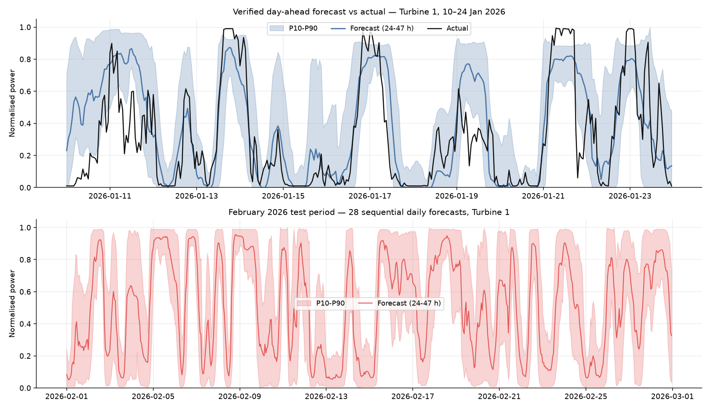
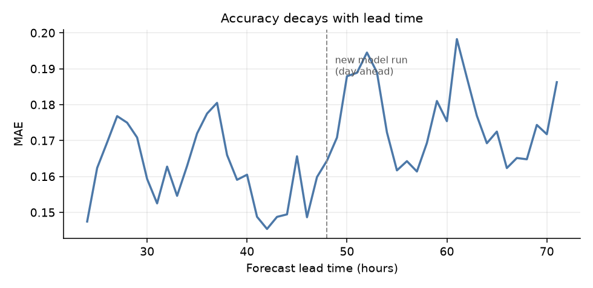

# WindAgent — Agentic hourly wind-power forecasting

An agentic AI system that forecasts hourly output for a two-turbine wind site in the
Shelek corridor, Kazakhstan, 24–48 hours ahead. It fetches its own weather data from
open sources, runs a trained power model, analyses the result, and recomputes when
fresher inputs arrive — then learns from its own verified errors.

Built for the HackAlemAI case (`task.md`). The deliverable is an hourly forecast for
**1–28 February 2026**, produced by replaying 28 sequential daily forecast cycles.



---

## Headline results

Scored on a **122-day out-of-sample replay** (issue dates 1 Oct 2025 – 30 Jan 2026,
11,412 verified hours). Power is normalised to rated capacity, so MAE is directly
readable as a fraction of nameplate.

| Forecast | MAE | RMSE | R² | Skill vs. persistence |
|---|---|---|---|---|
| **WindAgent, day-ahead (24–47 h)** | **0.1615** | 0.2181 | **0.636** | **52%** |
| WindAgent, all leads (24–71 h) | 0.1684 | 0.2273 | 0.605 | 50% |
| Power-curve baseline (no ML) | 0.1860 | 0.2460 | 0.538 | 45% |
| Persistence (yesterday repeated) | 0.3360 | 0.4175 | −0.33 | — |
| Climatology (hour-of-day mean) | 0.3187 | 0.3618 | 0.00 | 5% |

Both turbines score identically (MAE 0.1614 / 0.1616) — see
[Why both turbines get the same forecast](#why-both-turbines-get-the-same-forecast).

**The P10–P90 band covers 76.6%** of outcomes against an 80% target, after conformal
calibration lifted it from 72.2%.

**The daily recompute is worth 8.5%.** Every hour is forecast twice — once at 48–71 h
lead, then again the next day from a newer model run. On 5,682 identical hours, MAE
falls from 0.1754 to 0.1605. That is the "recompute when inputs update" step earning
its place, measured rather than asserted.



---

## Quickstart

```bash
python3.11 -m venv .venv && .venv/bin/pip install -r requirements.txt

# 1. Train the model (~2 min; downloads ~2 years of archived forecasts on first run)
.venv/bin/python -m src.train

# 2. Produce the February 2026 deliverable — 28 sequential daily cycles
.venv/bin/python -m src.backtest --start 2026-01-30 --end 2026-02-27 --label february_2026

# 3. Reproduce the scored out-of-sample replay
.venv/bin/python -m src.backtest --start 2025-10-01 --end 2026-01-30 --label verified

# 4. Run a single agent cycle and read the operator briefing
.venv/bin/python -m src.agent --date 2026-01-31
```

No API keys are needed for any of the above. Open-Meteo is free and unauthenticated.
Weather responses are cached to `cache/`, so re-runs are fast and offline-capable.

**The deliverable** is `outputs/february_2026_submission_local.csv` — 1,344 rows
(2 turbines × 28 days × 24 hours), every hour at a genuine 24–47 h lead, on the site's
local clock:

| column | meaning |
|---|---|
| `turbine` | `t1` / `t2` |
| `time_local` | target hour, site local time (UTC+6) |
| `time_utc` | same hour in UTC |
| `issue_time_utc` | when this forecast was made — always ≥24 h earlier |
| `lead_hours` | 24–47 |
| `forecast` | expected normalised power, 0–1 |
| `p10`, `p50`, `p90` | calibrated uncertainty band |

---

## The core constraint: an honest replay

The brief is strict that each forecast must use *the weather forecast available at that
moment*, not the weather that actually happened. This is the requirement most easily
violated by accident, and it is where most of the engineering went.

Open-Meteo's historical-forecast archive exposes two flavours of every variable:

| variable | what it is | usable? |
|---|---|---|
| `wind_speed_100m` | the most recent run's estimate (~0–24 h lead) | **No** — hindsight |
| `wind_speed_100m_previous_day1` | what the run from 1 day earlier predicted | **Yes** |
| `wind_speed_100m_previous_day2` | what the run from 2 days earlier predicted | **Yes** |

Every forecast in this project is built from `_previous_dayN`. We verified these are
genuine forecasts rather than relabelled analysis by checking that accuracy decays
monotonically with lead time, as physics requires:

| source | RMSE vs. measured wind | correlation |
|---|---|---|
| analysis (0–24 h) | 2.42 m/s | 0.790 |
| `previous_day1` (24–47 h) | 2.84 m/s | 0.691 |
| `previous_day2` (48–71 h) | 3.06 m/s | 0.642 |
| `previous_day3` (72–95 h) | 3.36 m/s | 0.565 |

A forecast issued on day D is assembled as a **48-hour block from a single model run**:
day D+1 from `previous_day1`, day D+2 from `previous_day2`. Lag, ramp and rolling
features are computed *within* a block — computing them across block boundaries would
quietly mix in a later model run that did not exist at issue time.

The same discipline applies elsewhere: SCADA state is read strictly before the issue
instant, the power curve is fitted on training rows only, and the online calibration
sees only forecasts whose target hour has already passed.

---

## How it works

```
                    ┌─────────────────── agent cycle, once per day ──────────────────┐
                    │                                                                 │
  Open-Meteo        │   1. fetch weather      ECMWF + GFS + ICON, at the right lead   │
  archive / live ───┼──▶ 2. prepare data      63 features, one 48 h block per run     │
                    │   3. run model          LightGBM point + P10/P50/P90            │
  SCADA history ────┼──▶ 4. calibrate         bias + band, from own verified errors   │
                    │   5. analyse            energy, ramps, confidence, QC           │
                    │   6. publish            hourly CSV + JSON briefing              │
                    │   7. check updates ─────┐ inputs moved? ──▶ recompute (back to 1)│
                    └─────────────────────────┴───────────────────────────────────────┘
```

### 1 — Weather: a real multi-model ensemble

The single largest accuracy gain in this project came not from the model but from the
weather input. Rather than accept one pre-blended "best guess", the system fetches three
**independent** numerical weather models and keeps all of them:

| source | RMSE vs. measured wind | correlation |
|---|---|---|
| ECMWF IFS 0.25° | 2.82 m/s | 0.726 |
| ICON | 2.86 m/s | 0.695 |
| GFS | 3.36 m/s | 0.670 |
| *blended `best_match` (what we started with)* | *2.84 m/s* | *0.691* |
| **ensemble mean of the three** | **2.44 m/s** | **0.772** |

Their **disagreement** is kept as a feature too, in both wind-speed and power units.
Two models differing by 2 m/s matters enormously near the power curve's knee and not at
all above rated — so each member is pushed through the power curve before comparing,
which wind-speed spread alone cannot distinguish.

### 2 — Features (63)

- **Physics** — air density from temperature/pressure/humidity, IEC density-corrected
  wind speed, wind shear exponent between 10 m and 100 m, wind power density (½ρv³),
  gust factor as a turbulence proxy, directional veer, sin/cos direction encodings.
- **Ramp awareness** — neighbouring-hour wind speeds (±3 h), 1 h and 3 h ramp rates,
  centred rolling mean/std over 3/6/12 h, all computed within the forecast block.
- **Ensemble** — per-member wind speeds, spread, min/max/range, and per-member
  power-curve output with its spread.
- **Physics-informed prior** — the site's own empirical power curve, fitted on training
  rows against *forecast* wind speed so it absorbs the NWP's bias rather than assuming
  the forecast and the anemometer agree. This is the single strongest feature.
- **Operating state** — mean power and availability over the 24 h before issue time,
  which lets the model carry an ongoing outage forward.
- **Calendar** — cyclic hour-of-day and day-of-year in local time.

### 3 — Model

One pooled LightGBM across both turbines (51,620 training rows), plus three quantile
regressors for P10/P50/P90. Deliberately small trees (31 leaves, 150 rows per leaf,
strong L1/L2): the weather input carries only so much information, and a larger model
memorised training seasons instead of generalising to the next one.

Curtailment and stuck-sensor hours are separated. Stuck sensors are bad data and never
train the model; curtailment is a real operational state and is kept in evaluation.

### 4 — Online calibration

Two corrections, both refitted every cycle from forecasts the system has already seen
verified, using only hours whose target time has passed:

- **Adaptive bias** — mean signed error over the last 14 days, capped at ±0.12 so one
  freak week cannot swing the forecast. This cut MAE 0.1709 → 0.1658 *and* collapsed
  bias from +0.053 to +0.011.
- **Conformal band scaling** — a split-conformal factor restoring nominal 80% coverage,
  scoring each observation in units of the model's own half-band so widening respects
  where the model already knew it was uncertain.

### 5–7 — Analysis, publication, recompute

Each cycle emits expected energy (equivalent full-load hours), peak and trough hours,
ramp events above 25% of rated within an hour, ensemble spread, and a confidence grade.
When confidence is low or a large ramp is forecast, the agent refetches and compares;
if the answer has moved materially it republishes and records why.

### Two ways to run the agent

**Autonomous** (default) — a deterministic policy runs the cycle end to end. No API key,
fully reproducible; this is what the backtest uses.

**Reasoning** (`--reason`) — the same steps are exposed to Claude (`claude-opus-5`) as
five callable tools via the Anthropic SDK's tool runner: `inspect_weather`,
`run_forecast_cycle`, `recent_performance`, `check_input_updates`, `publish_forecast`.
Claude decides what to inspect, judges whether spread warrants a recompute, and writes
the operator briefing.

One rule holds in both modes: **the language model never invents a number.** Every
figure it reports came back from a tool that ran the real model. Forecasts a control
room acts on are produced by code that behaves identically every time; the LLM reasons
*about* those numbers.

---

## What the data said

Several decisions came from measurement rather than assumption. They are recorded here
because they are the parts a reviewer would otherwise have to take on trust.

**The SCADA clock is UTC+6, constant.** Kazakhstan moved Almaty from UTC+6 to UTC+5 on
1 March 2024, so the obvious assumption is a changepoint mid-dataset. Cross-correlating
SCADA against NWP at 10-minute resolution shows none: wind speed peaks at 6.00 h and
temperature at 6.83 h (the extra lag is nacelle-sensor thermal inertia), stable across
both turbines and both eras. The logger evidently kept a fixed clock. A one-hour
misalignment here would have quietly degraded everything downstream.

**The weather is the bottleneck, not the model.** Given perfect knowledge of hub-height
wind, the fitted power curve alone reaches MAE 0.027 and R² 0.98. We are at 0.16. Almost
the entire remaining error is NWP wind error at 24–48 h lead, which is why effort went
into the ensemble rather than into a larger network.

**The NWP has a strong seasonal wind bias** — +1.08 m/s in January and +0.98 in
February, versus ~+0.2–0.4 in summer. Exactly the months that must be forecast.

**Explicit debiasing was tried and rejected.** A learned seasonal wind-bias correction
improved the naive power-curve baseline (0.186 → 0.176) but *hurt* the ML model
(0.178 → 0.186): the model already learns that correction internally, and the extra
features only added noise. The rolling bias correction fixed it properly instead.

**No icing or degradation signal.** Power at 6–10 m/s measured wind holds at 0.45–0.50
across every month and year in the record, so seasonal error is a weather-input problem,
not a turbine problem.

### Why both turbines get the same forecast

The two turbines stand ~400 m apart, inside a single Open-Meteo grid cell, so they
receive byte-identical weather. Pooled training gave `turbine_id` **zero split gain** —
the model found no statistically useful difference between the machines' power curves,
which their near-identical scores (MAE 0.1614 vs 0.1616) confirm. Their forecasts
therefore differ only when recent operating state diverges enough to cross a tree split.
This is a real property of the site, not a plumbing bug; it was verified explicitly.
Pooling was kept because it improved accuracy over per-turbine models (0.1709 vs 0.1771
and 0.1722).

---

## Repository layout

```
src/
  config.py       site coordinates, weather sources, time windows
  scada.py        SCADA loading, anomaly flagging, hourly aggregation, power curves
  weather.py      Open-Meteo client — archived (by lead) and live, with disk cache
  dataset.py      multi-model ensemble assembly; replays history into training rows
  features.py     forecast blocks and the 63-feature pipeline
  model.py        LightGBM point + quantile models
  calibration.py  online bias correction and conformal band scaling
  pipeline.py     the deterministic forecast cycle
  agent.py        agent tools, autonomous policy, and the Claude reasoning layer
  backtest.py     sequential daily replay and scoring
  metrics.py      scoring and the baselines a forecast must beat
  train.py        training entry point

outputs/    forecasts, scoring reports, per-day briefings
artifacts/  trained model and cached feature tables
reports/    figures
cache/      cached Open-Meteo responses (safe to delete)
```

---

## Honest limitations

- **February 2026 cannot be scored here.** The supplied dataset ends 31 January 2026, so
  the deliverable is unverifiable from this repository. All quoted accuracy comes from
  the 122-day out-of-sample replay immediately preceding it. February is winter, when
  NWP wind bias is at its seasonal worst, so treat the figures as an optimistic-leaning
  estimate for that month.
- **Online calibration freezes during February.** It learns from verified actuals; with
  none available after 31 January, it holds the correction derived from mid-to-late
  January. It resumes adapting the moment actuals arrive — no code change needed.
- **Lead-time archives begin ~March 2024**, so the first year of SCADA (March 2023
  onwards) cannot be used for lead-matched training. Training uses ~2 years.
- **Band coverage is 76.6% against an 80% target** — slightly overconfident.
- **Curtailment is not predicted.** It is ~0.7% of hours and driven by grid instructions
  the model cannot see. Curtailed hours are excluded from fitting but kept in scoring.
- **Ensemble spread predicts error only weakly** (correlation 0.14 with absolute wind
  error). It is useful but far from a complete uncertainty model.

## Where this would go next

- **Ensemble members, not just ensemble means.** Open-Meteo's ensemble API exposes
  30–50 perturbed members per model. Since weather is the binding constraint, this is
  the highest-value direction available.
- **Direct site-level aggregation** with spatial correlation, once more turbines exist.
- **Probabilistic-first dispatch** — the P10/P90 band already exists; pairing it with
  imbalance prices turns the forecast into a reserve-procurement recommendation.
- **Retraining on a schedule**, with the existing verification log as the trigger — the
  infrastructure for detecting drift is already in place.
